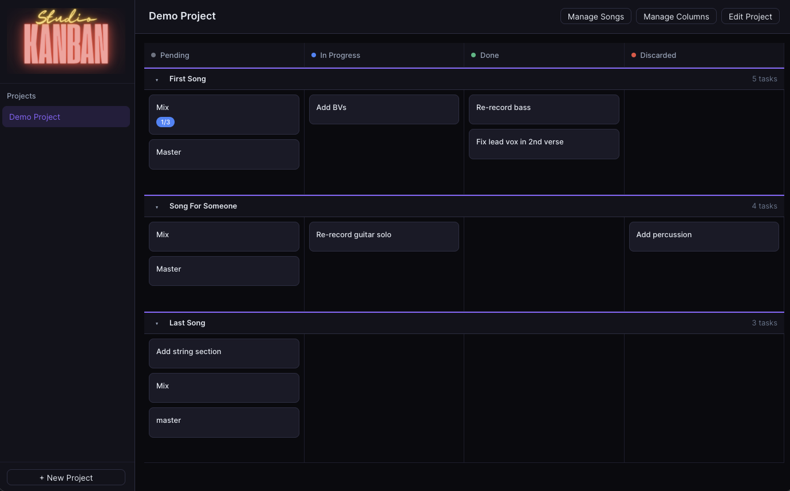

# Studio Kanban

A Kanban board for music production. Organize albums, songs, and production tasks — with a built-in Sequencing view for arranging your tracklist using SoundCloud.

**Demo** (single-user): [studio-kanban.fly.dev](https://studio-kanban.fly.dev/)

## Features

### Board view
- Projects with configurable columns (Pending → In Progress → Done → Discarded by default)
- Songs as collapsible swimlane headers spanning all columns
- Task cards with subtasks, assignee, description, and inline subtask editing
- Drag cards freely between any column in either direction
- Delete cards directly from the board with a confirmation prompt
- Export all data to JSON / Import from a previous export

### Sequencing view
- Connect a SoundCloud playlist to a project (public or private via share link)
- All tracks from the playlist appear in an **Unapproved** pool
- Drag tracks into the **Album sequence** panel to set the tracklist order — each slot gets a large track number
- The full playlist plays in a persistent dark-mode SoundCloud widget at the top; clicking a track card jumps the player to that track
- Switching to Board view keeps the player running in the background

### Multi-user (authenticated build)
- Google OAuth and email/password sign-in via Better Auth
- Projects are private to their owner
- Invite collaborators via a time-limited share link
- User avatar and sign-out in the sidebar

## Quick Start

```bash
docker compose up --build
```

Open [http://localhost:5173](http://localhost:5173)

> The database is created automatically on first run and persisted in a Docker volume.

### Multi-user build

Copy `.env.example` (or create `.env`) with:

```
GOOGLE_CLIENT_ID=
GOOGLE_CLIENT_SECRET=
BETTER_AUTH_SECRET=          # 32-char random string
BETTER_AUTH_URL=http://localhost:5173
SOUNDCLOUD_CLIENT_ID=
SOUNDCLOUD_CLIENT_SECRET=
```

Then `docker compose up --build`.

## Data Structure

- **Project** — a music project or album
- **Song** — a track within the project (swimlane on the board)
- **Task** — a unit of work within a song (Kanban card)
- **Subtask** — checklist item within a task
- **Sequence** — the approved tracklist order for a project’s SoundCloud playlist

## Deployment

Two Fly.io instances are maintained:

| Instance | Branch | URL |
|---|---|---|
| Demo (single-user) | `single-user-demo` | [studio-kanban.fly.dev](https://studio-kanban.fly.dev/) |
| Production (multi-user) | `main` | [studio-kanban-prod.fly.dev](https://studio-kanban-prod.fly.dev/) |

```bash
# Deploy demo
git checkout single-user-demo
fly deploy --remote-only

# Deploy production
git checkout main
fly deploy --remote-only --config fly.prod.toml
```

## Development

| Service  | URL |
|---|---|
| Frontend | http://localhost:5173 |
| Backend  | http://localhost:3001 |
| API spec | http://localhost:3001/api/openapi.json |

To regenerate frontend TypeScript types after backend changes:

```bash
cd frontend && npm run generate:api
```

## Screenshot


## Stack

- **Frontend**: Vite + React 19 + TypeScript, Zustand, TanStack Query, Radix UI, @dnd-kit
- **Backend**: Express + TypeScript, Drizzle ORM + SQLite (better-sqlite3)
- **Auth**: Better Auth v1 (Google OAuth, email/password)
- **API**: REST with auto-generated OpenAPI 3.1 spec
- **Hosting**: Fly.io (Docker, persistent SQLite volume)
